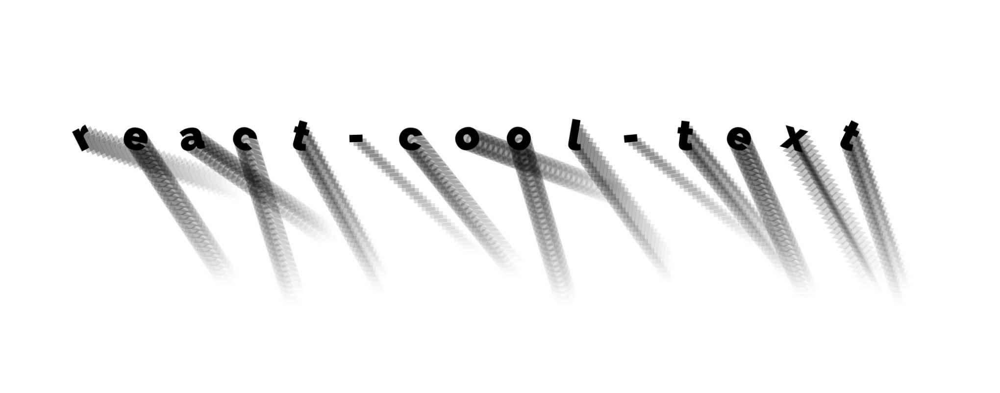

# react-cool-text

A cool text component for making your interwebzone look real stylish my dude. The package is written in typescript, compiled back to js, with typings declarations in the package.

## Requirements

-   React
-   Some kind of css loader

    Because this package uses css files for styling, anything consuming it will need a css loader of some sort, like webpack with css-loader.

## Use

To add to your project

```
npm install --save react-cool-text
```

or if you use yarn

```
yarn add react-cool-text
```

To use

```jsx
import * as React from 'react';
import { CoolText } from 'react-cool-text';

const MyCoolComponent: React.FunctionComponent = () => {
    return <CoolText>My cool text</CoolText>;
};
```

The children _must_ be a single string, or the component will not render, and everything will break.

`react-cool-text` takes a word, optionally repeats each of those letters a defined number of times in a stack, then runs a set of callbacks on each letter and each iteration of each letter. Some of these are random values defined with a min and a max.

For example, `randomScaleRange` takes a value like `{min: 0.1, max: 2}`, then scales each letter between 0.1 and 2

Meanwhile, `letterStackItemCount` takes a number, IE `10`, and `letterStackItemScale` takes a callback like `(letter, index) => index * 0.1`, which will then repeat each letter 10 times, with each item in that stack scaling up incrementally by 0.1

## Props

### Letter Stack Callbacks

These callbacks work on items in each letter stack

| prop                     | description                                          | example                                                          |
| ------------------------ | ---------------------------------------------------- | ---------------------------------------------------------------- |
| letterStackItemColor     | The colour to apply to each letter in the stack      | (stackIndex, letterIndex, letter) => 'red'                       |
| letterStackItemRotate    | The rotation to apply to each letter in the stack    | (stackIndex, letterIndex, letter) => letter === "h" ? 90 : 0     |
| letterStackItemScale     | The scale to apply to each letter in the stack       | (stackIndex, letterIndex, letter) => 0.1 \* stackIndex           |
| letterStackItemTranslate | The translation to apply to each letter in the stack | (stackIndex, letterIndex, letter) => {x: 10, y: 5 \* stackIndex} |
| letterStackItemOpacity   | The opacity to apply to each letter in the stack     | 0.3                                                              |
| letterStackItemZIndex    | The z index to apply to each letter in the stack     | (stackIndex, letterIndex, letter) => 50 - stackIndex             |
| letterStackItemClassName | The className to apply to each letter in the stack   | (stackIndex, letterIndex, letter) => "letter-" + letter          |

### Per Letter Randoms

These produce a random number between the min and max

| prop                 | description                                               | example                                          |
| -------------------- | --------------------------------------------------------- | ------------------------------------------------ |
| randomRotateRange    | Minimum and maximum amount of random rotation per letter  | {min: -10, max: 10}                              |
| randomScaleRange     | Minimum and maximum amount of random scale per letter     | {min: -10, max: 10}                              |
| randomTranslateRange | Minimum and maximum amount of random translate per letter | {x: {min: -10, max: 10}, y: {min: -10, max: 10}} |

### Letter Callbacks

These callbacks run on each letter

| prop                 | description                                         | example                                              |
| -------------------- | --------------------------------------------------- | ---------------------------------------------------- |
| letterStackItemCount | The number of times to repeat and stack each letter | (letterIndex, letter) => 20                          |
| letterColor          | Color to set each letter                            | (letterIndex, letter) => 'red'                       |
| letterRotate         | Amount to rotate each letter by                     | (letterIndex, letter) => letterIndex \* 2            |
| letterScale          | Amount to scale each letter by                      | (letterIndex, letter) => 1 + letterIndex \* 0.01     |
| letterTranslate      | Amount to translate each letter by                  | (letterIndex, letter) => {x: 0, y: letterIndex \* 2} |
| letterZIndex         | Z index to apply to each letter                     | (letterIndex, letter) => letterIndex \* 2            |
| letterClassName      | The className to apply to each letter               | (letterIndex, letter) => "letter-" + letter          |

### Wrapper props

These props apply to the div wrapping everything

| prop      | description                       | example        |
| --------- | --------------------------------- | -------------- |
| className | ClassName to apply to the wrapper | "my-cool-text" |
| id        | id to apply to the wrapper        | "my-cool-text" |

| _Per Letter Randoms_ | These produce a random number between the min and max | |

_The callbacks in these props can all also just take a value instead_

## Examples


```jsx
<CoolText
    key={word}
    letterStackItemCount={1}
    randomScaleRange={{ min: 0.2, max: 2 }}
    randomRotateRange={{ min: -20, max: 20 }}
    randomTranslateRange={{ x: { min: -10, max: 10 }, y: { min: -10, max: 10 } }}
>
    react-cool-text
</CoolText>
```



```jsx
<CoolText
    key={word}
    randomRotateRange={{ min: -30, max: 30 }}
    letterStackItemCount={30}
    letterStackItemOpacity={i => (i === 0 ? 1 : 0.3 - i * 0.01)}
    letterStackItemTranslate={i => ({ x: i * 4, y: i * 4 })}
>
    react-cool-text
</CoolText>
```
