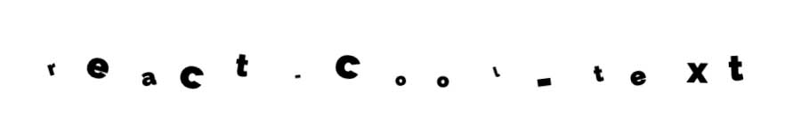

# react-cool-text

A cool text component for making your interwebzone look real stylish my dude. The package is written in typescript, compiled back to js, with typings declarations in the package.

## Requirements

-   React
-   Some kind of css loader

    Because this package uses css files for styling, anything consuming it will need a css loader of some sort, like webpack with css-loader.

## Use

To add to your project

```
npm install --save react-cool-text
```

To use

```jsx
import * as React from 'react';
import { CoolText } from 'react-cool-text';

const MyCoolComponent: React.FunctionComponent = () => {
    return <CoolText>My cool text</CoolText>;
};
```



## Props

TODO

## Examples

This example was achieved with the following props

```jsx
<CoolText
    key={word}
    letterStackItemCount={1}
    randomScaleRange={{ min: 0.2, max: 2 }}
    randomRotateRange={{ min: -20, max: 20 }}
    randomTranslateRange={{ x: { min: -10, max: 10 }, y: { min: -10, max: 10 } }}
>
    react-cool-text
</CoolText>
```
